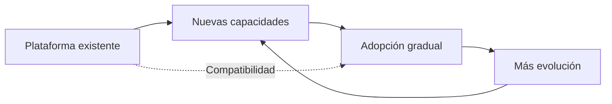

Cuando una tecnología supera las tres décadas, es fácil atribuir su permanencia a la estabilidad. Pero estabilidad no significa inmovilidad. Java no llegó hasta aquí por haberse resistido al cambio; llegó porque ha encontrado formas de evolucionar sin obligar a reemplazar todo lo construido antes.

## Cambiar sin empezar de cero

*The Java Story*, publicado recientemente, recorre la evolución de Java desde sus orígenes como Oak hasta convertirse en una plataforma utilizada durante décadas por desarrolladores y organizaciones. Más allá de la historia, deja una pregunta interesante:

**¿Cómo puede una plataforma cambiar durante tanto tiempo sin dejar de ser reconocible?**

El Java actual incorpora ideas que no existían en sus primeras versiones: generics, lambdas, módulos, records, pattern matching, virtual threads y numerosos cambios internos en la JVM. Aun así, esa evolución ha ocurrido intentando conservar una propiedad particularmente importante: la compatibilidad. No siempre es perfecta ni significa que actualizar sea automático; significa que evolucionar no parte necesariamente de asumir que todo lo anterior debe desaparecer.

## La compatibilidad también es una decisión de ingeniería

En tecnología solemos asociar innovación con reemplazo: nuevo framework, nueva arquitectura, nuevo lenguaje, nueva plataforma. A veces esa ruptura es necesaria, pero mantener una plataforma utilizada durante décadas plantea otro problema: cada decisión nueva debe convivir con una enorme cantidad de software existente.

Por eso, la compatibilidad puede entenderse como una restricción de diseño. El JDK continúa evolucionando bajo un [ciclo regular de releases de seis meses](https://openjdk.org/guide/#release-cycle), lo que permite introducir mejoras continuamente sin depender de grandes saltos entre versiones. La plataforma cambia, solo que buena parte de ese cambio ocurre de manera incremental.

## Java tampoco es solamente el lenguaje

La longevidad de Java tampoco puede explicarse observando únicamente su sintaxis.

Java también es:

- la JVM;
- OpenJDK;
- bibliotecas y frameworks;
- especificaciones;
- herramientas;
- implementaciones;
- y una comunidad que experimenta, discute y comparte conocimiento.

Eso ayuda a entender por qué la plataforma puede transformarse sin depender de una sola organización o de una sola pieza tecnológica. Incluso el ecosistema enterprise ha pasado por cambios importantes: Java EE evolucionó hacia Jakarta EE y el namespace `javax.*` dio paso a `jakarta.*`.

No fue quedarse igual; fue encontrar otra forma de continuar.

## Estabilidad y evolución no son opuestos

Quizá ahí está la parte más interesante. Una plataforma puede preservar compatibilidad y al mismo tiempo cambiar su runtime; puede mantener APIs existentes mientras introduce nuevas formas de resolver problemas; y puede incorporar capacidades modernas sin exigir que cada aplicación sea reescrita desde cero. Ese equilibrio probablemente explica mejor la longevidad de Java que la idea de que simplemente “sobrevivió”.

Después de más de treinta años, quizá la pregunta menos interesante sea si Java sigue vivo. La pregunta interesante es:

**¿qué permite que una tecnología evolucione durante décadas sin perder la confianza de quienes construyen sobre ella?**

No hay una sola respuesta: la JVM, la compatibilidad, el open source, el ecosistema y la comunidad importan.

**Java no sobrevivió por quedarse igual.** Sobrevivió porque aprendió a cambiar sin convertir cada evolución en un nuevo comienzo.

---

## Para continuar

[*The Java Story*](https://inside.java/2026/07/18/the-java-documentary/) ofrece una mirada mucho más amplia a las personas y decisiones detrás de esa evolución.

**¿Qué crees que ha sido más determinante para la longevidad de Java: la JVM, la compatibilidad, el ecosistema o la comunidad?**
